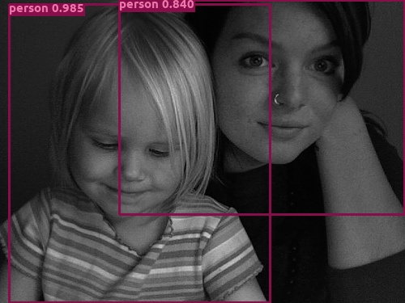

# Faster R-CNN in MXNet
Full precision          |  Binary precision
:-------------------------:|:-------------------------:
  |  

Full precision          |  Binary precision
:-------------------------:|:-------------------------:
  |  

Full precision          |  Binary precision
:-------------------------:|:-------------------------:
  |  

Full precision          |  Binary precision
:-------------------------:|:-------------------------:
  |  

Full precision          |  Binary precision
:-------------------------:|:-------------------------:
  |  

Full precision          |  Binary precision
:-------------------------:|:-------------------------:
  |  

Full precision          |  Binary precision
:-------------------------:|:-------------------------:
  |  

### Set up environment
Tested environment:
* Ubuntu 18.04
* python 3.6.9
 
### Build environment
* Build [BMXnet](https://github.com/SKutukov/BMXNet-v2)
* Install requirements.txt
```bash
 pip3 install -r requirements.txt
```

### Out-of-box inference models
Download any of the following models to the current directory and run `python3 demo.py --dataset $Dataset$ --network $Network$ --params $MODEL_FILE$ --image $YOUR_IMAGE$` to get single image inference.
For example `python3 demo.py --dataset voc --network vgg16 --params vgg16_voc0712.params --image myimage.jpg`, add `--gpu 0` to use GPU optionally.
Different network has different configuration. Different dataset has different object class names. You must pass them explicitly as command line arguments.

| step | layer                         | mAP  | link to weight                                    |
|------|-------------------------------|------|-------------------------------------------|
| 1    | conv64 conv64 conv128 conv128 | 0.74 | [step1](https://yadi.sk/d/1wd0NrmOw1y-Ng) |
| 2    | conv256 conv256 conv256       | 0.72 | [step2](https://yadi.sk/d/xULop-0NMqJx7w) |
| 3    | conv512 conv512 conv512       | 0.68 | [step3](https://yadi.sk/d/FozHA42zhK3hYw) |
| 4    | conv512 conv512 conv512       | 0.61 | [step4](https://yadi.sk/d/3iUdeLF7ujONXw) |
| 5    | Dense-1                       | 0.62 | [step5](https://yadi.sk/d/3iUdeLF7ujONXw) |

### Download data and label
Make a directory `data` and follow `py-faster-rcnn` for data preparation instructions.
* [Pascal VOC](http://host.robots.ox.ac.uk/pascal/VOC/) should be in `data/VOCdevkit` containing `VOC2007`, `VOC2012` and `annotations`.


### Download pretrained ImageNet models
* [VGG16](http://www.robots.ox.ac.uk/~vgg/research/very_deep/) should be at `model/vgg16-0000.params` from [MXNet model zoo](http://data.dmlc.ml/models/imagenet/vgg/).
* [ResNet](https://github.com/tornadomeet/ResNet) should be at `model/resnet-101-0000.params` from [MXNet model zoo](http://data.dmlc.ml/models/imagenet/resnet/).

### Training and evaluation
Use `python3 train.py --dataset $Dataset$ --network $Network$ --pretrained $IMAGENET_MODEL_FILE$ --gpus $GPUS$` to train,
for example, `python3 train.py --dataset voc --network vgg16 --pretrained model/vgg16-0000.params --gpus 0,1`.
Use `python3 test.py --dataset $Dataset$ --network $Network$ --params $MODEL_FILE$ --gpu $GPU$` to evaluate,
for example, `python3 test.py --dataset voc --network vgg16 --params model/vgg16-0010.params --gpu 0`.


### Disclaimer
This repository mostly used faster-rcnn implementation from [MXNet incubator](https://github.com/apache/incubator-mxnet),
