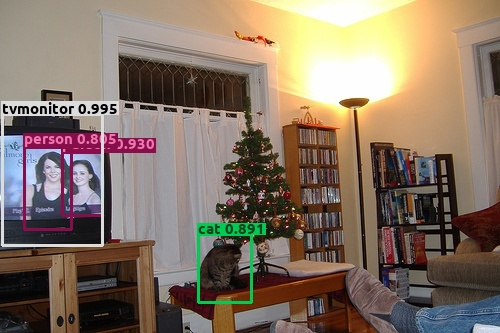

# 1-bit Quantized Faster R-CNN in MXNet
Full precision          |  Binary precision
:-------------------------:|:-------------------------:
  |  

Full precision          |  Binary precision
:-------------------------:|:-------------------------:
  |  

Full precision          |  Binary precision
:-------------------------:|:-------------------------:
  |  

Full precision          |  Binary precision
:-------------------------:|:-------------------------:
  |  

Full precision          |  Binary precision
:-------------------------:|:-------------------------:
  |  

Full precision          |  Binary precision
:-------------------------:|:-------------------------:
  |  

Full precision          |  Binary precision
:-------------------------:|:-------------------------:
  |  

### Set up environment
Tested environment:
* Ubuntu 18.04
* python 3.6.9
 
### Build environment
* Build [BMXnet](https://github.com/SKutukov/BMXNet-v2)
* Install requirements.txt
```bash
$ pip3 install -r requirements.txt
```

### Out-of-box inference models
Download any of the following models to the current directory and run `python3 demo.py --dataset $Dataset$ --network $Network$ --params $MODEL_FILE$ --image $YOUR_IMAGE$` to get single image inference.
For example `python3 demo.py --dataset voc --network vgg16 --params vgg16_voc0712.params --image myimage.jpg`, add `--gpu 0` to use GPU optionally.
Different network has different configuration. Different dataset has different object class names. You must pass them explicitly as command line arguments.

| step     | quanized layer                | mAP  | link                                         | speed-up | weight compressing |
|----------|-------------------------------|------|----------------------------------------------|----------|--------------------|
| оригинал | -                             | 0.76 | [original](https://yadi.sk/d/I9WiDe8fknLI2w) |     -    |          -         |
| 1        | conv64 conv64 conv128 conv128 | 0.74 | [step1](https://yadi.sk/d/NV4lQ5wp_8L4-w)    |   1.83   |        0.18%       |
| 2        | conv256 conv256 conv256       | 0.72 | [step2](https://yadi.sk/d/FyeOkkVCVI4K2A)    |   2.13   |        1.22%       |
| 3        | conv512 conv512 conv512       | 0.68 | [step3](https://yadi.sk/d/BRl7WgOAa2hTTQ)    |   2.37   |        5.39%       |
| 4        | conv512 conv512 conv512       | 0.61 | [step4](https://yadi.sk/d/1aqjy9x0a6K0NA)    |   2.57   |       10.39%       |
| 5        | Dense-1                       | 0.62 | [step5](https://yadi.sk/d/cA08mht_ycjq0A)    |   2.65   |       83.02%       |

### Download data and label
Make a directory `data` and follow `py-faster-rcnn` for data preparation instructions.
* [Pascal VOC](http://host.robots.ox.ac.uk/pascal/VOC/) should be in `data/VOCdevkit` containing `VOC2007`, `VOC2012` and `annotations`.

### Training and evaluation faster-rcnn-vgg16
```bash
$ bash scripts/run_train_faster_rcnn_qvgg.sh $STEP
```

```bash
$ bash scripts/run_test_faster_rcnn_qvgg.sh $STEP
```
### Test speed
1. Download weight to some dir
2.  run script
```bash
$ bash test_speed_up/run_speed_up.sh $DIR_WITH_WEIGHT $PATH_TO_BMXNET
```

### Disclaimer
This repository mostly used faster-rcnn implementation from [MXNet incubator](https://github.com/apache/incubator-mxnet),

### Reference 
1. Training Competitive Binary Neural Networks from Scratch, Joseph Bethge and Marvin Bornstein and Adrian Loy and Haojin Yang and Christoph Meinel
